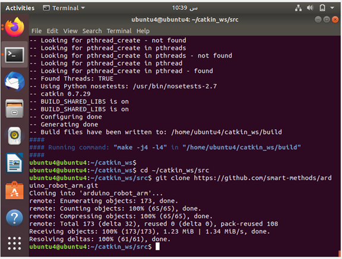
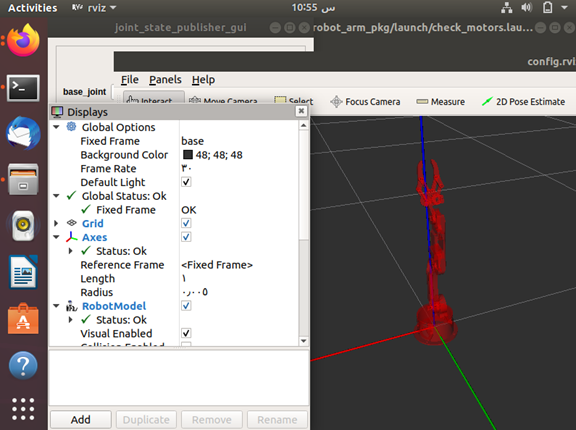
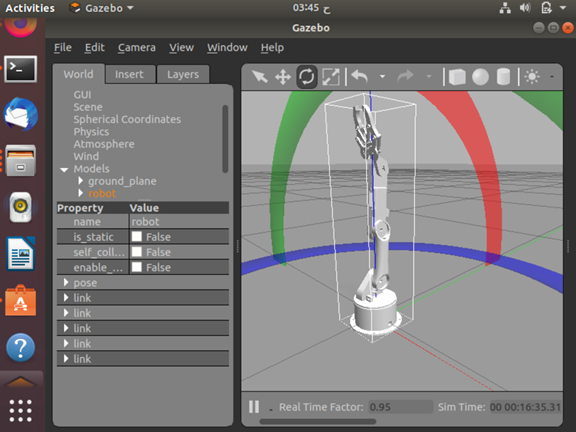

# arduino_robot_arm
 ## Installing the package arduino_robot_arm - task 2 for track AI at Smart-Methods summer training

1.  create Workspace directory in Ubuntu system's terminal </br>
`$ pwd`
`$ source /opt/ros/melodic/setup.bash`
`$ mkdir -p ~/catkin_ws/src`
</br>

2. open the directory in Ubuntu system's terminal </br>
`$ cd ~/catkin_ws/src`
3. Add the “arduino_robot_arm” package to “src” folder:
`$ sudo apt install git`

`$ git clone https://github.com/smart-methods/arduino_robot_arm`


4. install the dependencies 
`cd ~/catkin_ws`

$ rosdep install --from-paths src --ignore-src -r -y

$ sudo apt-get install ros-melodic-moveit

$ sudo apt-get install ros-melodic-joint-state-publisher ros-melodic-joint-state-publisher-gui

$ sudo apt-get install ros-melodic-gazebo-ros-control joint-state-publisher

$ sudo apt-get install ros-melodic-ros-controllers ros-melodic-ros-control
5. at the end of the (bashrc) file add the follwing line
`(source /home/Areej/catkin_ws/devel/setup.bash)`
*Note : change "Areej" to your system name*
6. press:
- ctrl + o
- Enter
- crtl + x
7. runs Rviz:

`$ roslaunch robot_arm_pkg check_motors.launch`

---
8. [Download Arduino IDE on your Ubuntu system](https://www.arduino.cc/en/software)

```
{
 $ cd ~/catkin_ws

$ cd src

$ git clone https://github.com/ros-drivers/rosserial.git

$ cd 

$ pwd

$ catkin_make

$ catkin_make install

$ pwd

$ cd 

$ pwd

$ ls

$ cd home

$ cd "your system name"

$ ls

$ cd Arduino

$ ls

$ cd libraries

$ pwd

$ clear

$ pwd

$ rm -rf ros_lib

$ rosrun rosserial_arduino make_libraries.py . 
}
```

9. Controlling the motors in simulation
$ roslaunch robot_arm_pkg check_motors.launch


$ roslaunch robot_arm_pkg check_motors_gazebo.launch

$ rosrun robot_arm_pkg joint_states_to_gazebo.py
10.  run moveIt
$ roslaunch moveit_setup_assistant setup_assistant.launch

$ roslaunch moveit_pkg demo.launch

11. open Gazebo
$ roslaunch moveit_pkg demo_gazebo.launch



